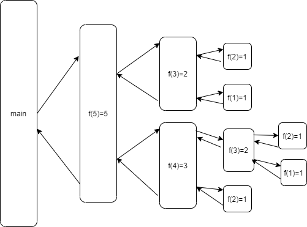

### 12. 递归

​          递归调用指在方法执行过程中出现该方法本身的调用。

​          求Fibonacci数列：1, 1, 2, 3, 5, 8, ... 第n个数的值，数列满足递推公式：

​          F<sub>1</sub> = 1, F<sub>2</sub> = 1 ... F<sub>n</sub>= F<sub>n-1</sub> + F<sub>n-2</sub> (n>2)

​          代码实现：

```java
public class Test{
    public static void main(String[] args) {
        System.out.println(f(5));
    }
    
    public static int f(int n) {
        if(n<=2) {
            return 1;
        }
        return f(n-1) + f(n-2);
    }
}
```

代码编译运行结果为：

```
5 //第5个斐波那契的数是：5
```

斐波那契递归数列调用示意图：

