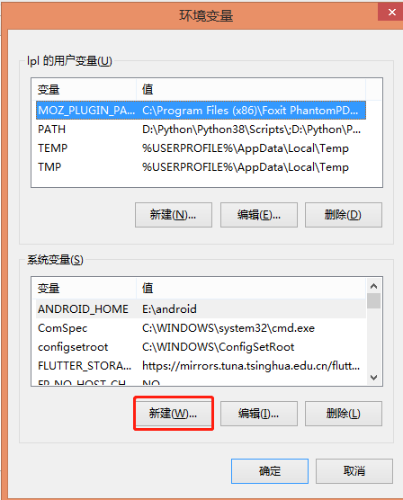
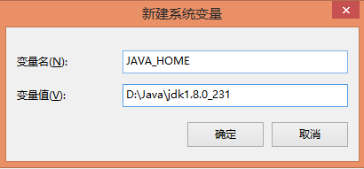
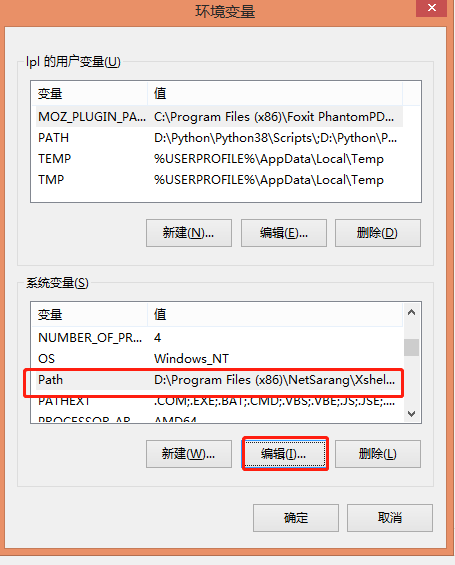
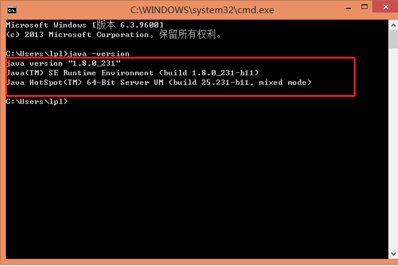
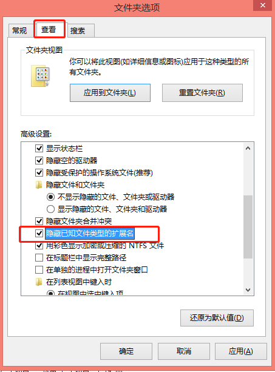

### 2. java环境搭建安装

#### 2.1 JDK下载

​      开发人员要进行开发需要安装```jdk```，程序运行的话环境只需要```jre```，所以我们作为开发人员，需要下载```jdk```，最新版本为```jdk17```，``下载地址为oracle 官网: [https://www.oracle.com/java/technologies/downloads/](https://www.oracle.com/java/technologies/downloads/)。如下图所示：


选择对应的电脑环境下载不同的版本。

#### 2.2 windows环境搭建

​      windows为直接一键安装，建议安装时候路径不要选择带有中文和空格的路径。我本机安装的```JDK8```，安装路径为：```D:\Java\jdk1.8.0_231```，文章就以此路径为前提配置环境变量。

##### 2.2.1 配置```JAVA_HOME```

​       右键点击我的电脑，点击属性。


​     打开属性，选择高级系统设置，然后点击环境变量配置。

​			

打开环境变量对话框，点击新建。



打开新建变量对话框，输入变量名为```JAVA_HOME```，变量值为JDK的安装路径，点击确定保存，如图所示。



windows 7 和window 8 系统配置如上图，window 10系统过程类似，变量路径可以用鼠标选择，选到```jdk```安装目录```bin```目录的上级目录即可。如下图安装目录结构所示，则选择到```D:\Java\jdk1.8.0_231```即可


##### 2.2.2 配置```PATH```变量值

​        编辑系统环境变量里的```path```变量值：



编辑打开之后，window 7或window 8在值得末尾添加英文的分号```;```，然后继续添加```%JAVA_HOME%\bin```，点击确定保存。


保存成功之后，同时按下windows键+```R```键，打开运行对话框，输入```cmd```命令，点击确定。


打开命令窗口输入```java -version```，显示如下图，则配置成功。

​		

#### 2.3 linux环境搭建

​	  linux 环境搭建```jdk```，一般下载后缀为```jdk-8u231-linux-x64.tar.gz```的安装文件。使用```tar -zxvf jdk-8u171-linux-x64.tar.gz```命令进行解压缩，演示的解压目录为:```/root/jdk1.8.0_231```。

​     编辑环境变量文件，使用命令```vim /etc/profile```，打开文件，按`insert`键进入编辑模式。在文件末尾加入以下变量:

```
export JAVA_HOME=/root/jdk1.8.0_231
export JRE_HOME=/root/jdk1.8.0_231/jre
export CLASSPATH=.:$JAVA_HOME/lib:$JRE_HOME/lib:$CLASSPATH
export PATH=$JAVA_HOME/bin:$JRE_HOME/bin:$PATH
```

​     按```ESC```键退出编辑模式，在英文模式下输入```:wq```保存文件。

​     执行命令```source /etc/profile```，成功之后执行```java -version```，查看环境变量是否配置成功。


​     好了，环境搭建完毕，下一节我们将熟悉下java的代码——```Hello World!```。

#### 2.4 windows文件的扩展名显示

​     windows 文件的后缀扩展名默认是隐藏的，我们需要做些设置让其显示。首先打开系统任一盘符，比如C盘，点击菜单栏的```查看```按钮，然后点击```选项```按钮，如下图：


​      打开选项卡之后，切换```查看``` 选项卡，将```隐藏已知文件类型的扩展名```前面的勾取消，点击确定即可。



   确定保存之后文件的后缀就会显示，这样我们再用文本编辑工具写程序时就能新建```.java```后缀的文件。
