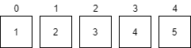

### 21.数组

#### 21.1 数组概念

​        

​        数组是一种数据结构，把相同类型的数据组合一在一起。

​        数组变量属于引用类型。

​        数组中元素可以是任何的数据类型，基本类型和引用类型均可。

​        数组的长度为n，数组下标从0开始到n-1，如果访问的下标不再0-(n-1)之间，则会报出数组下标越界异常。

#### 21.2 一维数组的声明

​         声明方式，类型 变量名字[]：

​         type variableName[];  或 type[] variableName;

​         例子：

          ```
          int a1[];
          int[] a2;
          double []b;
          Animal [] animal;
          int a[4]//非法，java声明数组时不能指定其长度
          ```

​          java数组中使用关键字new 创建数组对象，格式为：

​          数组名 = new 数组元素类型[数组元素的个数];

```java
public class Test {
    public static void main(String[] args){
        int[] s;
        s = new int[5];
        for(int i=0;i<5;i++){
           //给数组的元素赋值
           s[i]=i;
        }
    }
}
```

​          数组定义与数组元素分配空间及赋值操作分开进行，例：

```java
public class Test{
    public static void main(String[] args){
        String str[];
        str = new String[3];
        str[0]="Hello";
        str[1]="World";
        str[2]="!";
    }
}
```

​          在定义数组的同时就为数组元素分配空间并赋值，例：

```java
public class Test{
    public static void main(String[] args){
        String str[] = {"hello","world","!"};
    }
}
```

​        数组引用类型，元素相当于类的成员变量，数组分配空间后，每个元素将按照成员变量的规则被隐式初始化。

```java
public class Test{
    public static void main(String[] args){
        String str[];
        str = new String[4];
        str[0]="Hello";
        str[1]="World";
        str[2]="!";
        System.out.println(str[3]); //null 被隐式初始化
    }
}
```

​           数组定义之后使用new关键字为之分配空间后，才可以引用数组中的每个元素，引用方式为：

   arrayName[index]，index为数组下标，数组元素下标从0开始，长度为n的数组下标为0~n-1。

​           每个数组都有一个属性```length```指明其长度。

​           例1：

```java
public class Test {
	public static void main(String[] args) {
		int[] a = {2, 4, 6, 7, 3, 5, 1, 9, 8};
		//a.length 代表数组a的长度
		for(int i=0; i<a.length; i++) {
			System.out.print(a[i] + " ");
		}
		
	}
}
```

​         例2：

​         查找元素是否在给定的数组中？

```java
public class Test{
    /**
     *判断num是否是数组a中的元素找到第1个即返回，如果是返回其下标，不是返回-1
     */
    public static int searchArray (int[] a, int num){
        //直接for循环遍历数组
        for (int i=0;i<a.length;i++) {
            if(a[i]==num){
                return i;
            }
        }
        return -1;
    }
    
      
    public static void main(String[] args){
        int a[]= {3,2,5,12,34,56,2,1,3,9};
        int num = 56;
        Sysetm.out.println(searchArray(a, num));
    }
}
```

#### 21.3 二维数组

​        二维数组可以看成元素为数组的数组。例如：

​        `int [][] a = { {1,2}, {3,4,5}, {7,8,9}}`

​        java 多维数组声明、初始化都是需要按顺序初始化，从一维、二维...依次进行。

​        二维数字初始化定义：

```
//静态初始化
int a[][] = {{1,2},{3,4}};
int b[3][3]={{1,2,3},{4,5,6},{7,8,9}};//非法，静态不用制定长度
//动态初始化
int a[][] = new int[3][5];
int b[][] = new int[3][]; //不指定一维元素的数组的个数
```

​         数组的复制，使用的系统类```System```的`arraycopy`方法：

```java
public static native void arraycopy(Object src,  int  srcPos,
                                        Object dest, int destPos,
                                        int length);
```

```java
public class Test{
    public static void main(String args[]) {
    	String[] src = 
            {"Hello","world","！"};
        String[] dst = new String[3];
        System.arraycopy(src,0,dst,0,src.length);
        //如果源数据数目超过目标数组边界会抛出IndexOutOfBoundsException异常。
        for(int i=0;i<dst.length;i++){
          System.out.print(dst[i]+" ");
        }	
    }
}
```

