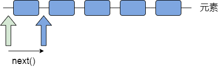

### 26.容器

​       jdk 所提供的容器API位于`java.util`包内。

#### 26.1 Collection 接口

​        `Collection`接口定义的方法有：

```java
//容器的容量
int size();
//容器是否为空
boolean isEmpty();
//清空容器
void clear();
//容器是否包含某个元素
boolean contains(Object element);
//容器添加元素
boolean add(Object element);
//容器移除元素
boolean remove(Object element);
//用于遍历容器中的元素
Iterator iterator();
//容器添加另外一个容器所有元素
boolean addAll(Collection c);
```

例1：

```java
import java.util.ArrayList;
import java.util.Collection;

public class Test{
    public static void main(String[] args){
        Collection c = new ArrayList ();
        c.add("hello");
        c.add(false);
        c.add(10);
        System.out.println(c);

    }
}
```

编译运行结果为：

```
[hello, false, 10]
```

例2：

```java
import java.util.ArrayList;
import java.util.Collection;

public class Test{
    public static void main(String[] args){
        Collection c = new ArrayList ();
        c.add("hello");
        c.add(false);
        c.add(10);
        System.out.println(c);
        //remove 移除某个元素
        c.remove("hello");
        System.out.println(c);
        System.out.println(c.contains(10));
    }
}
```

编译运行结果：

```
[hello, false, 10]
[false, 10]
true
```

* 容器Collection类对象在调用`remove`、`contains`等方法时需要比较对象是否相等，会涉及到对象的类型`equals` 和 `hashCode`方法，对于程序员自定义的类，需要注意重写`equals`和`hashCode`方法，实现自定义类对象相等的判断规则。

#### 26.2 Iterator接口

* 所有实现了`Collection`接口的容器类都有一个`iterator()`方法，返回了一个实现`Iterator`接口的对象。

* `Iterator`对象称作迭代器，用于对容器内元素的遍历操作。

  常用方法：

  ```
  boolean hasNext(); //判断游标右边是否还有元素
  Object next();//返回游标右边的元素并移动到下一个位置
  void remove;//删除游标左面的元素，执行完next()之后，该操作只能执行一次
  
  ```

​       示例图：



例子：

```java
import java.util.ArrayList;
import java.util.Collection;
import java.util.Iterator;

public class Test{
    public static void main(String[] args){
        Collection c = new ArrayList ();
        c.add("hello");
        c.add(false);
        c.add(10);
        System.out.println(c);
        Iterator it = c.iterator();
        while(it.hasNext()){
            Object obj = it.next();
            System.out.println(obj);
        }
    }
}

```

编译运行结果：

```
[hello, false, 10]
hello
false
10
```

​         jdk1.5 增强for循环例子：

```java
import java.util.ArrayList;
import java.util.Collection;
public class Test {
	public static void main(String[] args) {
		int[] arr = {1, 2, 3, 4, 5};
		for(int i : arr) {
			System.out.println(i);
		}
		
		Collection c = new ArrayList();
		c.add(new String("aaa"));
		c.add(new String("bbb"));
		c.add(new String("ccc"));
        //增强for循环，从jdk1.5开始仅用于遍历元素
        //如果要删除元素的话还是要用iterator
        //增强for循环不方便知道元素对应的下标值
		for(Object o : c) {
			System.out.println(o);
		}
	}
}
```

#### 26.3 Set接口

* `Set`接口是`Collection`的子接口，Set接口容器类中的元素是无序的且不可以重复，实现Set接口的容器有`HashSet`、`TreeSet`等类。

```java
import java.util.*;

public class Test{
    public static void main(String[] args){
         Set s = new HashSet();
         s.add("hello");
         s.add("world");
         s.add(100);
         s.add("hello");//相同元素不会被加入
         System.out.println(s);

    }
}

```

编译运行结果：

```
[world, 100, hello]
```

#### 26.4 List接口

​        `List`接口是`Collection`的子接口，实现List接口的容器类元素是有序的且可以重复。List容器有序，所以元素都有下标标识其在容器中的位置，也可以根据序号找到位置对应的元素。实现`List`接口的容器类有`ArrayList`、`LinkedList`等。

​        `List`接口的常用方法：

```java
Object get(int index);
Object set(int index,Object element);
void add(int index, Object element);
Object remove(int index);
int indexOf(Object o);
```

例子：

```
import java.util.*;

public class Test{
    public static void main(String[] args){
         List l1 = new LinkedList();
         l1.add(1);
         l1.add(2);
         l1.add(3);
         System.out.println(l1);
         l1.add(2,4);
         System.out.println(l1);
         l1.set(1,"5");
         System.out.println(l1);

    }
}

```

编译运行结果为：

```
[1, 2, 3]
[1, 2, 4, 3]
[1, 5, 4, 3]
```

