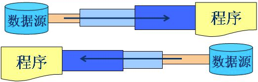
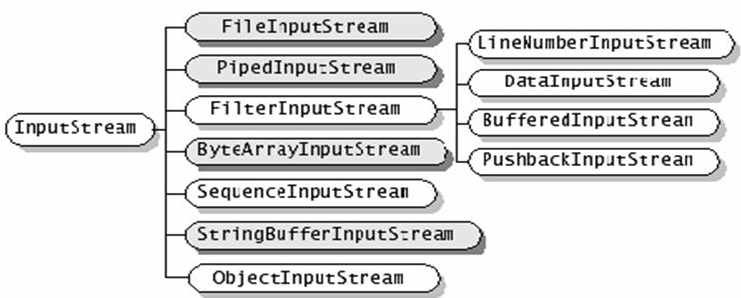
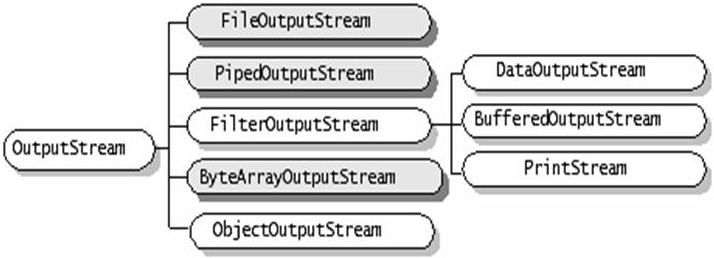
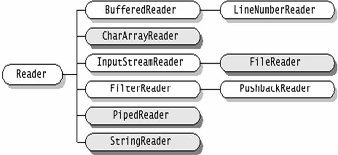
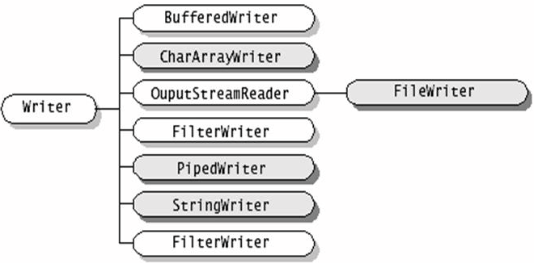

### 28.流

​         java程序中，对于数据的输入、输出操作均已“流”的方式进行。jdk提供了各种流类，用于获取不同的数据类型，如：文件流，网络流，内存流等。

#### 28.1 流的分类

* 案处理数据单位不同分为：字节流、字符流
* 数据流方向不同分为：输入流、输出流
* 功能不同可以分为：节点流、处理流

   jdk所提供的流类型位于`java.io`内的都分别继承以下表格中的流类型

|  类型  |    字节流    | 字符流 |
| :----: | :----------: | :----: |
| 输入流 | InputStream  | Reader |
| 输出流 | OutputStream | Writer |

**节点流**：

​        从一个特定的数据源读写数据，是直接操作文件、网络、内存的流。`FileInputStream`和`FileOutputSteam`直接从文件中读取或往文件中写入字节流。


**处理流**：

​       ”连接“在已存在的流之上通过对数据的处理为程序提供强劲的读写功能。例如`BufferedInputStream`和`BufferedOutputStream`，使用已经存在的节点流来构造，提供带缓冲的读写，提高了读写的效率，以及`DataInputStream`和`DataOutputStream`，使用已经存在的节点流来构造，提供了读写Java中的基本数据类型的功能。他们都属于处理流。



例子：

```java

import java.io.*;

public class Test{
    public static void main(String[] args) {
        try (
            // 节点流FileOutputStream直接以a.txt作为数据源操作
            FileOutputStream fileOutputStream = new FileOutputStream("a.txt");
            // 过滤流BufferedOutputStream进一步装饰节点流，提供缓冲写
            BufferedOutputStream bufferedOutputStream = new BufferedOutputStream(
                fileOutputStream);
            // 过滤流DataOutputStream进一步装饰过滤流，使其提供基本数据类型的写
            DataOutputStream out = new DataOutputStream(bufferedOutputStream);
        )
        {
            out.writeInt(3);
            out.writeBoolean(true);
            out.flush();
            // 此处输入节点流，过滤流正好跟上边输出对应，读者可举一反三
            DataInputStream in = new DataInputStream(new BufferedInputStream(
                new FileInputStream("a.txt")));
            System.out.println(in.readInt());
            System.out.println(in.readBoolean());
        } catch (FileNotFoundException e) {
            e.printStackTrace();
        } catch (IOException e) {
            e.printStackTrace();
        }
    }
}

```

Note：**try() 小括号里面的代码是jdk8的新特性，里面的流在代码执行完毕后jvm会自动关闭，不用再写finally代码块**

继承自`InputStream` 的流都是用于向程序中输入数据，且数据的单位都是字节(byte=8bit)，如图，深色的为节点流，浅色的为处理流。



`InputStream`的基本方法：

```java
//读取一个字节并一整数形式返回(0-255)
//如果返回-1表示读取到流的末尾
int read() throws IOException
//读取一系列字节并存储在数组buffer中
//返回实际读取到字节数，如果到末尾返回-1
int read(byte[] buffer) throws IOException
//从offset位置开始读取length个字节，并存储在buffer字节数组中
//返回实际读取到字节数，如果到末尾返回-1    
int read(byte[] buffer, int offset,int length) throws IOException
//关闭流释放资源，一般在finally代码块中执行
void close() throws IOException
//跳过n个字节不读，返回实际跳过的字节数
long skip(long n) throws IOException
```


继承自`OutputStream` 的流都是程序向外输出数据，且数据的单位都是字节(byte=8bit)，如图，深色的为节点流，浅色的为处理流。



`OutputStream`的基本方法：

```java
//向输出流中写入一个字节数据，该数据为参数的低8位
void write(int i) throws IOException
//将字节类型数组数据写入输出流
void write(byte[] b) throws IOException
//将一个字节类型数组数据从指定位置offset开始length个字节写入到输出流
void write(byte[] b,int offset, int length) throws IOException
//关闭流释放资源，一般在finally代码块里面执行
void close() throws IOException
//输出流的缓冲数据立即写入到目的地
void flush() throws IOException
```


继承自`Reader` 的流都是用于向程序中输入数据，且数据的单位都是字符(2byte=16bit)，如图，深色的为节点流，浅色的为处理流。



`Reader`的基本方法：

```java
//读取一个字符并一整数形式返回(0-65535)
//如果返回-1表示读取到流的末尾
int read() throws IOException
//读取一系列字符并存储在数组buffer中
//返回实际读取到字符数，如果到末尾返回-1
int read(char[] buffer) throws IOException
//从offset位置开始读取length个字符，并存储在buffer字符数组中
//返回实际读取到字符数，如果到末尾返回-1    
int read(char[] buffer, int offset,int length) throws IOException
//关闭流释放资源，一般在finally代码块中执行
void close() throws IOException
//跳过n个字符不读，返回实际跳过的字符数
long skip(long n) throws IOException
```


继承自`Writer` 的流都是用于程序中向外输出数据，且数据的单位都是字符(2byte=16bit)，如图，深色的为节点流，浅色的为处理流。



`Writer`的基本方法：

```java
//向输出流中写入一个字符数据，该数据为参数的低16位
void write(int i) throws IOException
//将字符类型数组数据写入输出流
void write(char[] cbuf) throws IOException
//将一个字符类型数组数据从指定位置offset开始length个字符写入到输出流
void write(char[] cbuf,int offset, int length) throws IOException
//将一个字符串中字符写入到输出流
void write(String str) throws IOException
//将一个字符串从offset开始的length个字符写出到输出流
void write(String str,int offset, int length) throws IOException
//关闭流释放资源，一般在finally代码块里面执行
void close() throws IOException
//输出流的缓冲数据立即写入到目的地
void flush() throws IOException
```

* 节点流类型：

|     类型      |              字符流              |                   字节流                    |
| :-----------: | :------------------------------: | :-----------------------------------------: |
|   File 文件   |      FileReader、FileWriter      |      FileInputStream、FileOutputStream      |
| Memory Array  | CharArrayReader、CharArrayWriter | ByteArrayInputStream、ByteArrayOutputStream |
| Memory String |    StringReader、StringWriter    |                                             |
|   Pipe管道    |     PipedReader、PipedWriter     |     PipedInputStream、PipedOutputStream     |

字节输入流：

```java
import java.io.*;
public class Test {
  public static void main(String[] args) {
    int b = 0;
    FileInputStream in = null;
    try {
      in = new FileInputStream("d:\\1.txt");
    } catch (FileNotFoundException e) {
      System.out.println("文件不存在"); 
      return;
    }
    
    try {
      long num = 0;
      while((b=in.read())!=-1){
        System.out.print((char)b); 
        num++;
      }
      in.close();  
      System.out.println();
      System.out.println("一共读取了"+num+"个字节");
    } catch (IOException e1) {
      System.out.println("读取错误抛出异常");  
    }
  }
}
```

字节输出流例子：

```java
import java.io.*;
public class TestFileOutputStream {
  public static void main(String[] args) {
	  int b = 0;
	  FileInputStream in = null;
	  FileOutputStream out = null;
	  try {
	    in = new FileInputStream("d:\\1.txt");
	    out = new FileOutputStream("d:\\2.txt");
	    while((b=in.read())!=-1){
	      out.write(b);
	    }
	    in.close(); 
	    out.close();
	  } catch (FileNotFoundException e2) {
	    System.out.println("找不到指定文件"); 
         return;
	  } catch (IOException e1) {
	    System.out.println("文件复制错误"); 
        return;
	  }
	  System.out.println("文件已复制");
  }
}

```

字符输入流例子：

```java
import java.io.*;
public class Test  {
  public static void main(String[] args) {
    
    int c = 0;
    //try 后面紧跟括弧jdk8的新特性，可以把需要关闭的流放在其中，程序自动关闭
    //不需要再在写在finally代码块
    try (FileReader fr =  new FileReader("d:\\3.txt");  ) {
      while ((c = fr.read()) != -1) {
        System.out.print((char)c);
      }
    } catch (FileNotFoundException e) {
      System.out.println("找不到指定文件");
    } catch (IOException e) {
      System.out.println("文件读取错误");
    } 
  }
}
```

字符输出流例子：

```java
import java.io.*;
public class Test  {
  public static void main(String[] args) {
    FileWriter fw = null;
    try (FileWriter fw= new FileWriter("d:\\4.txt");) {
      fw 
      for(int c=0;c<=50000;c++){
        fw.write(c);
      }
      fw.close();
    } catch (IOException e1) {
    	e1.printStackTrace();
      System.out.println("文件写入错误");
       
    }
  }
}

```


* 处理流类型：

|                  类型                  |                字符流                 |                  字节流                   |
| :------------------------------------: | :-----------------------------------: | :---------------------------------------: |
|               Buffering                |    BufferedReader、BufferedWriter     | BufferedInputStream、BufferedOutputStream |
|               Filtering                |      FilterReader、FilterWriter       |   FilterInputStream、FilterOutputStream   |
| Converting between bytes and character | InputStreamReader、OutputStreamWriter |                                           |
|          Object Serialization          |                                       |   ObjectInputStream、ObjectOutputStream   |
|            Data conversion             |                                       |     DataInputStream、DataOutputStream     |
|                Counting                |           LineNumberReader            |           LineNumberInputStream           |
|             Peeking ahead              |             PusbackReader             |            PusbackInputStream             |
|                Printing                |              PrintWriter              |                PrintStream                |

#### 28.2 缓存流

缓存流要“套接”在相应的节点流之上，对读写的数据提供缓存功能，提高了读写的效率，并增加了一些新的方法。

常用的缓存流：

```java
BufferedReader(Reader in)
//自定义缓存区大小
BufferedReader(Reader in,int size)
BufferedWriter(Writer out)
BufferedWriter(Writer out, int size)
BufferedInputStream(InputStream in)
BufferedInputStream(InputStream in,int size)
BufferedOutputStream(OutputStream out)
BufferedOutputStream(OutputStream out,int size)
```

`BufferedReader`提供了`readLine`方法用于读取一行字符串（已`\r`或`\n`分割）。

`BufferedWriter`提供了`newLine`用于写入换行分隔符。

对于输出的缓存流，写出的数据会在内存中缓存，调用`flush`方法将会内存中的数据立刻写出。

例1：

```java
import java.io.*;
public class Test  {
  public static void main(String[] args) {
    try {
      FileInputStream fis = 
              new FileInputStream("d:\\1.txt");
      BufferedInputStream bis = 
              new BufferedInputStream(fis);
      int c = 0;
      System.out.println(bis.read());
      System.out.println(bis.read());
      bis.mark(100);
      for(int i=0;i<=10 && (c=bis.read())!=-1;i++){
        System.out.print((char)c+" ");
      }
      System.out.println();
      //流的指针重置，从开始地方继续读取
      bis.reset();
      for(int i=0;i<=10 && (c=bis.read())!=-1;i++){
        System.out.print((char)c+" ");
      }
      bis.close();
    } catch (IOException e) {e.printStackTrace();}
  }
}
```

例2：

```java
import java.io.*;
public class Test {
  public static void main(String[] args) {
    try {
      BufferedWriter bw = new BufferedWriter(new FileWriter("d:\\2.txt"));
      BufferedReader br = new BufferedReader(
             new FileReader("d:\\2.txt"));
      String s = null;
      for(int i=1;i<=100;i++){
        s = String.valueOf(Math.random());
        bw.write(s);
        bw.newLine();
      }
      bw.flush();
      while((s=br.readLine())!=null){
        System.out.println(s);
      }
      bw.close(); 
      br.close();
    } catch (IOException e) { e.printStackTrace();}
  }
}
```

#### 28.3 转换流

* `InputStreamReader`和`OutputStreamWriter`用于字节流到字符流之间的数据转换。
* `InputStreamReader`和`InputStream`转换。
* `OutputStreamWriter`和`OutputStream`转换。
* 转换流在构造时可以制定编码集合。

例子1：

```java
import java.io.*;
public class Test  {
  public static void main(String[] args) {
    try {
      OutputStreamWriter osw = new OutputStreamWriter(
           new FileOutputStream("d:\\1.txt"));
      osw.write("hello");
      System.out.println(osw.getEncoding());
      osw.close();
      //ISO8859_1 一种编码格式，不能编码中文，中文编码有gbk gb2312 utf-8
      osw = new OutputStreamWriter(
      								new FileOutputStream("d:\\2.txt", true),
      								"ISO8859_1"); // latin-1
      osw.write("world");
      System.out.println(osw.getEncoding());
      osw.close();
    } catch (IOException e) {
      e.printStackTrace();
    }
  }
}
```

例子2：

```java
import java.io.*;
public class Test {
  public static void main(String args[]) {
    InputStreamReader isr = 
            new InputStreamReader(System.in);
    BufferedReader br = new BufferedReader(isr);
    String s = null;
    try {
      s = br.readLine();
      while(s!=null){
        if(s.equalsIgnoreCase("exit")) break;
        System.out.println(s.toUpperCase());
        s = br.readLine();
      }
      br.close();
    } catch (IOException e) {
      e.printStackTrace();
    }
  }
} //阻塞	
```

#### 28.4 数据流

​        `DataInputStrem`和`DataOutputStream`提供了可以存取机器无关的java基本类型数据的方法。

构造方法如下：

```java
DataInputStream(InputStream in)
DataOutputStream(OutputStream out)
```

例子：

```java
import java.io.*;
public class Test  {
  public static void main(String[] args) {
    ByteArrayOutputStream baos = 
                        new ByteArrayOutputStream(); 
    DataOutputStream dos = 
                        new DataOutputStream(baos);
    try {
      dos.writeDouble(Math.random());
      dos.writeBoolean(true);
      ByteArrayInputStream bais = 
          new ByteArrayInputStream(baos.toByteArray());
      System.out.println(bais.available());
      DataInputStream dis = new DataInputStream(bais);
      System.out.println(dis.readDouble());
      System.out.println(dis.readBoolean());
      dos.close();  dis.close();
    } catch (IOException e) {
      e.printStackTrace();
    }
  }
}
```

#### 28.4 Print 流

`PrintWriter`和`PrintStream`都属于输出流，分别是字符流、字节流。提供了重载的`print`、`println`方法用于多种数据类型的输出。这两种流输出操作不会抛出异常，用户通过检测错误状态获取错误信息、二者皆有自动`flush`功能

例子1：

```java
import java.io.*;
public class Test   { 
  public static void main(String[] args) {
    PrintStream ps = null;
    try {
      FileOutputStream fos = 
              new FileOutputStream("d:\\1.dat");
      ps = new PrintStream(fos);
    } catch (IOException e) {
      e.printStackTrace();
    }
    if(ps != null){
      System.setOut(ps);
    }
    int ln = 0;
    for(char c = 0; c <= 2000; c++){
      System.out.print(c+ " ");
      if(ln++ >=100){ System.out.println(); ln = 0;}
    }
  }
}

```

例子2：

```java
import java.io.*;
public class TestPrintStream2 {
  public static void main(String[] args) {
    String filename = args[0];
    if(filename!=null){list(filename,System.out);}
  }
  public static void list(String f,PrintStream fs){
    try {
      BufferedReader br = 
                  new BufferedReader(new FileReader(f));
      String s = null; 
      while((s=br.readLine())!=null){
        fs.println(s);            
      }
      br.close();
    } catch (IOException e) {
      fs.println("无法读取文件");
    }
  }
}
```

#### 28.5 Object流

​        直接将Object写入或读出

```java
import java.io.*;

public class TestObjectIO {
	public static void main(String args[]) throws Exception {
		TestSerializable t = new TestSerializable();
		t.k = 8;
		FileOutputStream fos = new FileOutputStream("d:\\1.dat");
        //object 输出流，序列化
		ObjectOutputStream oos = new ObjectOutputStream(fos);
		oos.writeObject(t);
		oos.flush();
		oos.close();
		
		FileInputStream fis = new FileInputStream("d:\\1.dat");
        //object输入流 反序列化
		ObjectInputStream ois = new ObjectInputStream(fis);
		TestSerializable tReaded = (TestSerializable)ois.readObject();
		System.out.println(tReaded.i + " " + tReaded.j + " " + tReaded.d + " " + tReaded.k);
		
	}
}
// 类实现 Serializable接口代表该类可以被序列化，
class TestSerializable implements Serializable {
	int i = 10;
	int j = 9;
	double d = 2.3;
    //transient 修饰的字段可以不用序列化、反序列化
	transient int k = 15;
}
```

