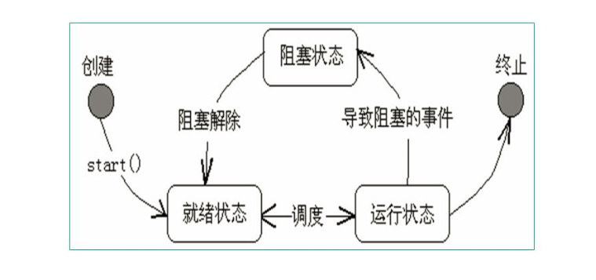

### 30.多线程

#### 30.1 概念

线程是一个程序内部的顺序控制流。

线程和进程的区别：

* 每个进程都有独立的代码和数据空间，进程间切换会有较大的开销
* 线程可以看成是轻量级的进程，同一类线程共享代码和数据空间，每个线程有独立的运行栈和程序计数器，线程切换的开销小
* 多进程：在操作系统中能同时运行多个任务（程序）。
* 多线程：在同一程序中多个顺序流同时执行。

java的线程是通过` java.lang.Thread `类来实现的。

VM启动时会有一个主线程来调用`main`方法。

可以通过创建`Thread`的实例来创建新的线程。

每个线程都通过`Thread`对象所对应的`run`方法完成其操作，方法称为线程体。

通过调用`Thread`类的`start`方法来启动一个线程。

#### 30.2 线程创建启动

方式一：

* 定义类实现` java.lang.Runnable`接口，并重写`run`方法
* `Thread t = new Thread(target);` //target为实现`Runnable`的接口类型
* 在实现`Runnable`的`run`方法定义中使用`Thread`的静态方法：

​             `Thread.currentThread()`来获取当前线程的引用。

方法二：

可以定义一个`Thread`的子类并重写run方法。然后直接使用子类对象启动。

#### 30.3 线程状态切换



#### 30.4 常用方法

##### 30.4.1 isAlive

判断线程是否还活着，即线程是否还未终止。

##### 30.4.2 getPriority setPriority

获取线程的优先级数值和设置线程的优先级数值

##### 30.4.3 sleep

可以调用`Thread`的静态方法，使得当前线程休眠，停止运行millis毫秒

`public static native void sleep(long millis) throws InterruptedException;`

例如：`Thread.sleep(1000L);`当前线程停止运行1000毫秒。

例子：

```java
import java.util.*;
public class Test  {
  public static void main(String[] args) {
    MyThread thread = new MyThread();
    thread.start();
    try {Thread.sleep(10000);}
    catch (InterruptedException e) {}
    thread.interrupt();
  }
}

class MyThread extends Thread {
	boolean flag = true;
  public void run(){
    while(flag){
      System.out.println("==="+new Date()+"===");
      try {
        sleep(1000);
      } catch (InterruptedException e) {
        return;
      }
    }
  }
}
```

##### 30.4.4 join

合并某个线程，join方法的主要作用就是同步，它可以使得线程之间的并行执行变为串行执行

例子：

```java
public class Test  {
  public static void main(String[] args) {
    MyThread2 t1 = new MyThread2("abcde");
    t1.start();
    /**join的意思是使得放弃当前线程的执行，并返回对应的线程，例如下面代码的意思就是：
         程序在main线程中调用t1线程的join方法，则main线程放弃cpu控制权，并返回t1线程继续执行直到线程t1执行完毕
         所以结果是t1线程执行完后，才到主线程执行，相当于在main线程中同步t1线程，t1执行完了，main线程才有执行的机会
         */
    try {
    	t1.join();
    } catch (InterruptedException e) {}
    	
    for(int i=1;i<=10;i++){
      System.out.println("i am main thread");
    }
  }
}
class MyThread2 extends Thread {
  MyThread2(String s){
  	super(s);
  }
  
  public void run(){
    for(int i =1;i<=10;i++){
      System.out.println("i am "+getName());
      try {
      	sleep(1000);
      } catch (InterruptedException e) {
      	return;
      }
    }
  }
}

```

##### 30.4.5 yield

让出cpu，让其他线程执行的机会

例子：

```java
public class Test  {
  public static void main(String[] args) {
    MyThread3 t1 = new MyThread3("t1");
    MyThread3 t2 = new MyThread3("t2");
    t1.start(); t2.start();
  }
}
class MyThread3 extends Thread {
  MyThread3(String s){super(s);}
  public void run(){
    for(int i =1;i<=100;i++){
      System.out.println(getName()+": "+i);
      if(i%10==0){
        yield();
      }
    }
  }
}

```

#### 30.5 线程优先级

* Java提供一个线程调度器来监控程序中启动后进入就绪状态所有线程，线程调度器按照线程的优先级决定调度哪个线程来执行。
* 线程的优先级用数字表示，范围从1到10，默认值是：5.

```
Thread.MIN_PRIORITY = 1;
Thread.MAX_PRIORITY = 10;
Thread.NORM_PRIORITY = 5;
```

* 使用下列方法获取优先级

```
int getPriority()
void setPriority(int newPriority)
```

例子：

```java
public class Test  {
	public static void main(String[] args) {
		Thread t1 = new Thread(new T1());
		Thread t2 = new Thread(new T2());
		t1.setPriority(Thread.NORM_PRIORITY + 3);
		t1.start();
		t2.start();
	}
}

class T1 implements Runnable {
	public void run() {
		for(int i=0; i<1000; i++) {
			System.out.println("T1: " + i);
		}
	}
}

class T2 implements Runnable {
	public void run() {
		for(int i=0; i<1000; i++) {
			System.out.println("------T2: " + i);
		}
	}
}
```

#### 30.6 线程同步

* 在java中，引入了对象互斥锁的概念，保证共享数据操作的完整性。每个对象都对应于一个可称为"互斥锁"的标记，此标记保证在任一时刻，只能有一个线程访问该对象。
* 关键字`synchronized`来与对象的互斥锁联系，当某个对象或方法被`Synchronized`修饰时，表明该对象在任一时刻只能有一个线程访问。
* 多线程使用锁易造成死锁，需要时刻注意。

例子：

```java
public class TestDeadLock implements Runnable {
	public int flag = 1;
	static Object o1 = new Object(), o2 = new Object();
	public void run() {
System.out.println("flag=" + flag);
		if(flag == 1) {
            //死锁
			synchronized(o1) {
				try {
					Thread.sleep(500);
				} catch (Exception e) {
					e.printStackTrace();
				}
				synchronized(o2) {
					System.out.println("1");	
				}
			}
		}
		if(flag == 0) {
			synchronized(o2) {
				try {
					Thread.sleep(500);
				} catch (Exception e) {
					e.printStackTrace();
				}
				synchronized(o1) {
					System.out.println("0");
				}
			}
		}
	}	
	
	public static void main(String[] args) {
		TestDeadLock td1 = new TestDeadLock();
		TestDeadLock td2 = new TestDeadLock();
		td1.flag = 1;
		td2.flag = 0;
		Thread t1 = new Thread(td1);
		Thread t2 = new Thread(td2);
		t1.start();
		t2.start();
		
	}
}
```

#### 30.7 wait sleep区别

* wait时别的线程可以访问锁定对象，调用wait方法时候必须锁定该对象
* sleep别的线程也不可以访问锁定对象
