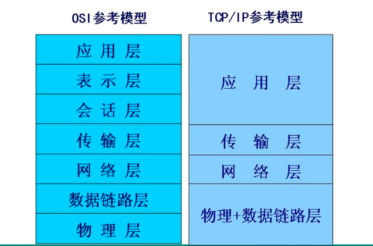
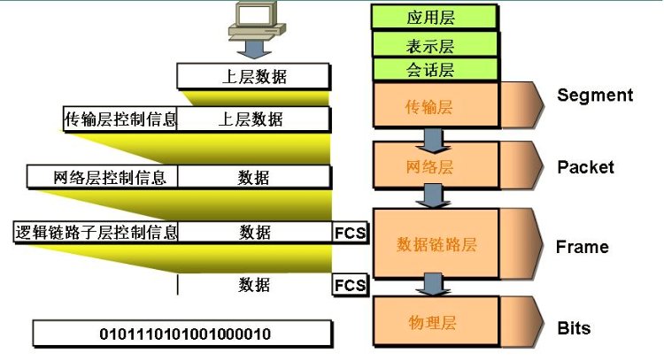
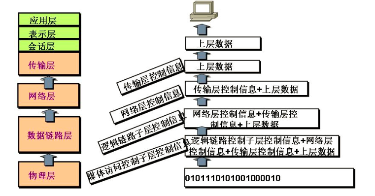
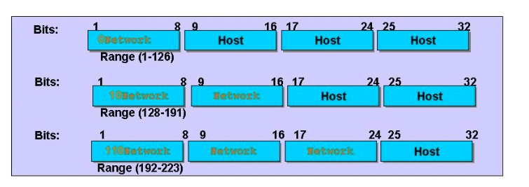
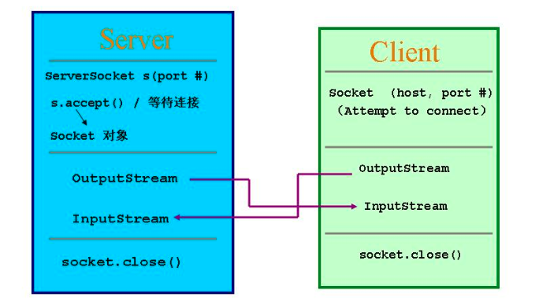

### 31. 网络编程

#### 31.1 网络基础概念

分布不同地理之为的计算机通过专门的外部设备用通信线路互联成一个规模大、功能强的网络系统，从而众多用户共享信息，传递信息等资源。主要包含以下几项功能：资源共享、信息传输与集中处理、均衡负荷与分布处理、综合信息服务。

#### 31.2 通信协议及接口

计算机网络中实现通信必须有约定俗称的通信协议，对速率、传输代码、结构、传输控制等制定标准。

协议分层：

由于结点与结点之间联系很复杂，在制定协议时，把负责协议逐步分层，在将他们复合起来。把用户应用程序作为最高层，把物流通信线路作为最低层。

参考分层模型：



数据封装：



数据拆装：



#### 31.3 IP协议

IP(`Internet Protocol`)是网络层的主要协议，支持网络间互联的数据报通信，主要功能有：

无连接数据报发送，数据报路由选择和差错控制

数据包示意图：



#### 31.4 TCP UDP

##### 31.4.1 TCP（Transmission Control Protocol）

传输控制协议：

是专门设计用于在不可靠的网络中提供可靠的端对端的字节流通信协议，面向连接的协议，TCP连接时字节流而非报文流。

##### 31.4.2 UDP（User Data Protocol）

用户数据报协议：

UDP向应用程序提供了一种发送封装的原始IP数据报的方法，并且发送时无需建立连接，是一种不可靠的连接。

##### 31.4.3 Socket

* 两个java应用程序可通过一个双向的网络通信连接实现数据交换，这个双向链路的一端是Socket
* Socket通常用来实现client-server连接
* `java.net`包中定义的两个类`Socket`和`ServerSocket`，分别来实现双向连接的client和server端
* 建立连接时所需的寻址信息为远程计算机的ip地址和端口号(Port Number)

​        TCP端口 UDP端口分开的，每一个有65536个端口。

 TCP Socket通信模型：



例子：

Server端：

```java
import java.net.*;
import java.io.*;

public class TCPServer {
	public static void main(String[] args) throws Exception {
		ServerSocket ss = new ServerSocket(6666);
		while(true) {
			Socket s = ss.accept();
System.out.println("a client connect!");
			DataInputStream dis = new DataInputStream(s.getInputStream());
			System.out.println(dis.readUTF());
			dis.close();
			s.close();
		}
		
	}
}
```

Client端：

```java
import java.net.*;
import java.io.*;

public class TCPClient {
	public static void main(String[] args) throws Exception {
		Socket s = new Socket("127.0.0.1", 8888);
		OutputStream os = s.getOutputStream();
		DataOutputStream dos = new DataOutputStream(os);
		Thread.sleep(30000);
		dos.writeUTF("hello server!");
		dos.flush();
		dos.close();
		s.close();
	}
}
```

