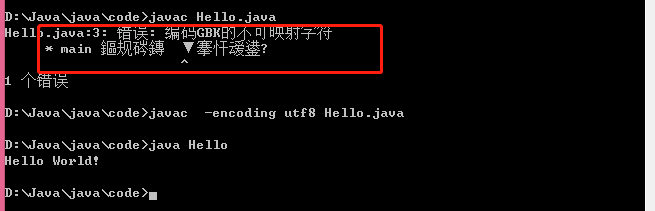

### 4. Java 程序初识

#### 4.1 HelloWorld程序

   以```Hello.java```为例，java应用程序的执行入口是```main()``` 方法，其有固定格式：

  ```java
  /**
   * 类文件，一个源文件最多只能有一个public类，且与文件名称一致
   */
  public class Hello {
      /**
       * main 方法是程序入口
       */
      public static void main(String [] args){
          System.out.println("Hello World!");
      }
  }
  ```

   java 程序有如下特点：

- Java源文件是以```.java```结尾的文本文件

- 类文件，一个源文件最多只能有一个public类，且与文件名称一致，其它类的数量不限

- Java程序的主入口是main方法，固定格式如上所示

- 严格区分大小写

- java每条语句以英文分号结束```;```

- 注释有三种方式

  ```//``` 用于表示单行注释

  ```
  /*
    表示多行注释
  */
  ```

  ```
  /**
   * 用于多行注释，可以被 java doc 解析
   */
  ```

  #### 4.2 编译程序

  ​      ```javac``` 命令用于编译源代码，有许多选项用于编译参数，后续会用到。利用```cmd```命令进入命令行进行编译操作```javac  Hello.java```。如图所示：

  

  ​     使用```javac Hello.java```编译时文件里面有中文时编码会乱码，文件是以`utf-8`编码保存的，windows编译时默认编码是```gbk```，所以编译失败。此时增加编码选项进行编译```javac  -encoding utf8 Hello.java```即编译成功。编译成功即生成```Hello.class```文件。

  #### 4.3 运行文件

  ​     ```java``` 代码用于执行代码。使用命令```java Hello```，执行代码。执行成功即如图上所示打印```Hello World!```。

####       4.4 总结

​             试着自己安装好java环境，并成功运行```Hello World```，熟悉java程序的简单规则及编译运行。

